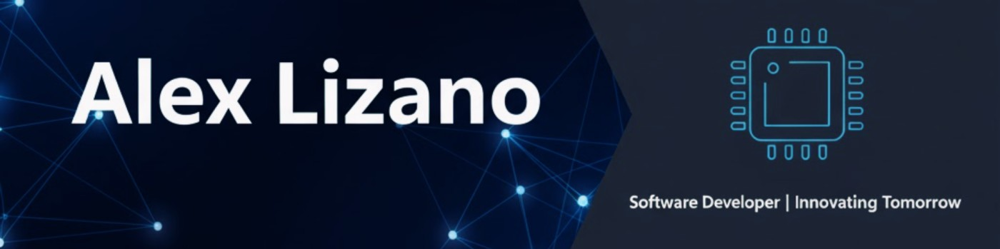

  

# Hi there, I'm Alex Lizano 👋

## Software Engineering Student | Full Stack Developer

Passionate about Full Stack development. Specialized in building robust and scalable solutions using technologies like .NET Core, NestJS, React, and Angular.

- 🔭 I’m currently working on **Full Stack Web Development**
- 🌱 I’m currently learning **Data Analysis**
- 🎓 **Education**: Software Engineering at Universidad Técnica de Ambato (2021 - Present)
- 🎮 **Hobbies**: I love video games, I also enjoy traveling and listening to music.

## 🌐 Portfolio

Check out my full portfolio here: [**portfolio-delta-ten-57.vercel.app**](https://portfolio-delta-ten-57.vercel.app/)

## 🛠️ Tech Stack

### Languages

### Backend

### Frontend

### Database

### Tools

## 🚀 Featured Projects

| Project | Description | Tech Stack | Links |
|---------|-------------|------------|-------|
| **Enruta** | Web platform for managing routes and trips for bus companies. |     |     |
| **Casa de la Cultura** | Web System for managing space reservations. |    |     |
| **AutoPick** | Vehicle Rental Platform. |     |     |
| **Citas Médicas ECU** | Medical Appointments Platform. |     | 🔒 Private |

## 💼 Experience

**Software Development Intern** @ Ambacar Cia. Ltda.
_July 2025 - November 2025_
- Migrated critical logistics system modules using a microservices pattern and Clean Architecture in .NET Core 7.
- Implemented user interfaces using Angular.
- Implemented administrative and parameterization modules.

## 📫 Connect with me

---
⭐️ From [Alex Lizano](https://github.com/IAlexLizano)
